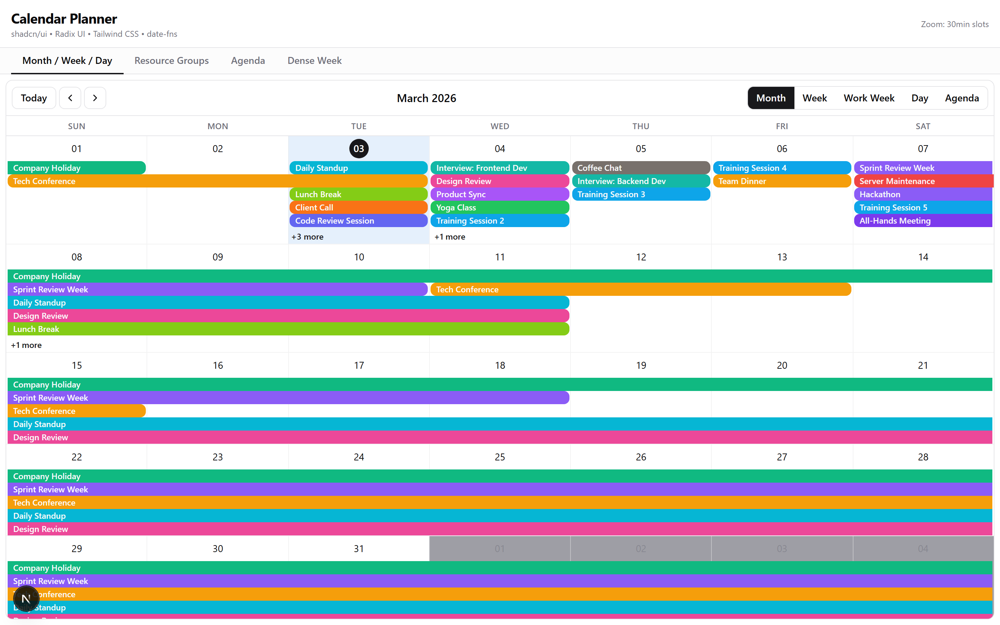
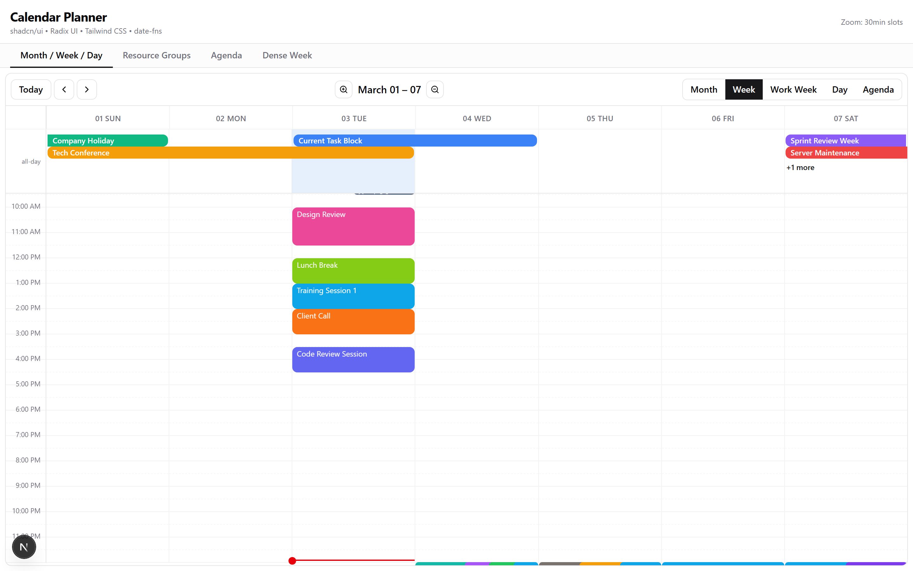
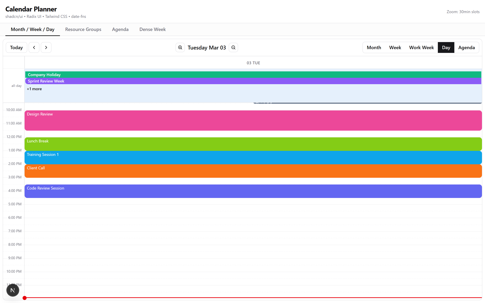
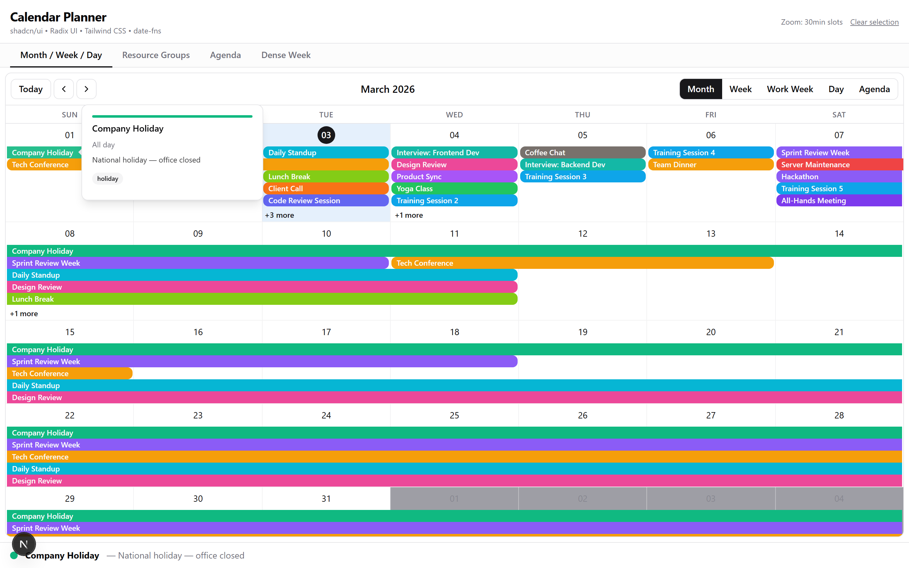
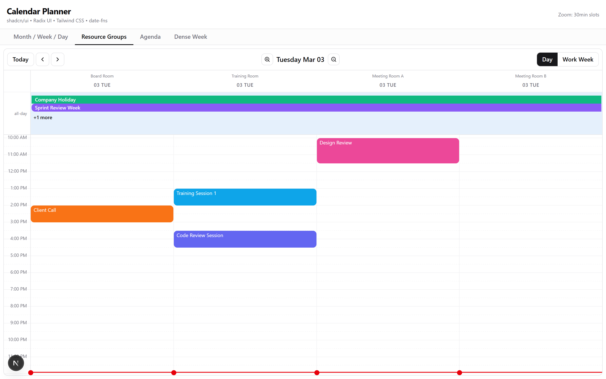
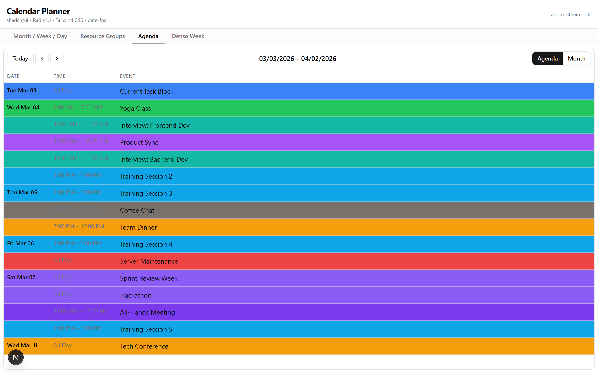
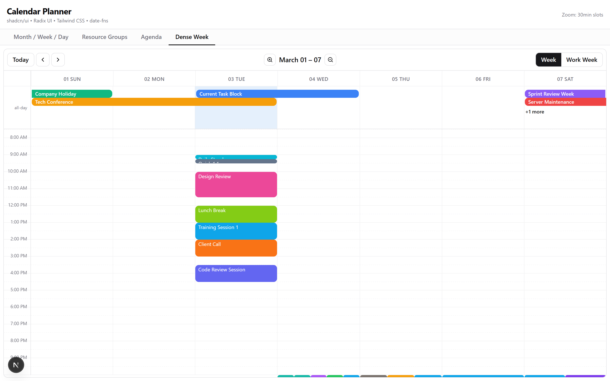
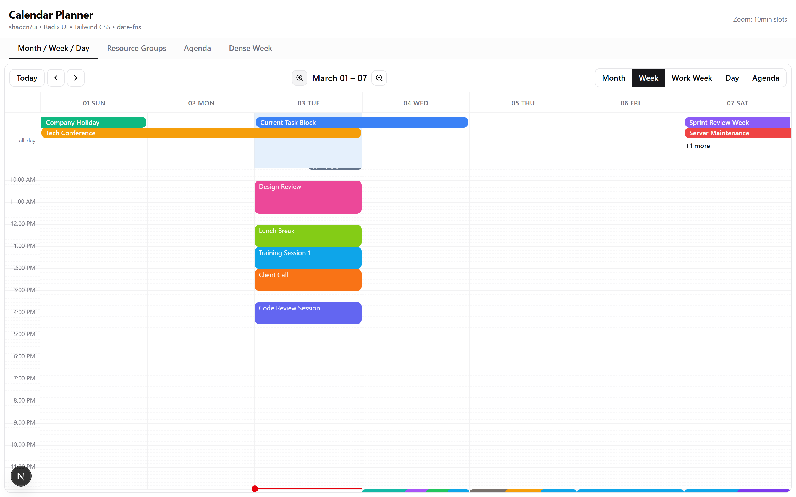
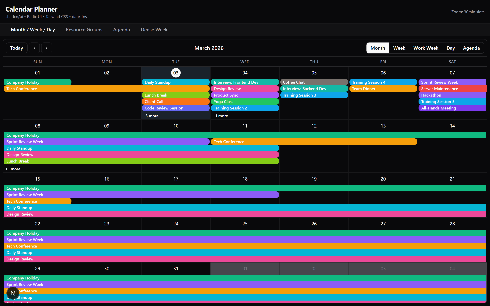

<p align="center">
  
</p>

<h1 align="center">shadcn-calendar-planner</h1>

<p align="center">
  A full-featured calendar component built with <strong>shadcn/ui</strong>, <strong>Radix UI</strong>, <strong>Tailwind CSS</strong>, and <strong>date-fns</strong>.<br />
  Month · Week · Work Week · Day · Agenda · Resource Groups · Zoom · Popovers · Dark Mode
</p>

<p align="center">
  <a href="https://github.com/garethcheyne/shadcn-calendar-planner"></a>
  <a href="https://github.com/garethcheyne/shadcn-calendar-planner"></a>
  <a href="https://github.com/garethcheyne/shadcn-calendar-planner"></a>
  <a href="https://github.com/garethcheyne/shadcn-calendar-planner"></a>
</p>

---

## Screenshots

| View | Screenshot |
|------|-----------|
| **Month** |  |
| **Week** |  |
| **Day** |  |
| **Event Popover** |  |
| **Resource Groups** |  |
| **Agenda** |  |
| **Dense Week (no-overlap)** |  |
| **Zoom In (fine time slots)** |  |
| **Dark Mode** |  |

---

## Features

- **5 built-in views** — Month, Week, Work Week, Day, Agenda
- **Resource groups** — split columns by room, person, or any resource
- **Zoom in/out** — 7 time-slot levels from 5-minute to 2-hour granularity
- **Event popovers** — Radix Popover with fully customizable content
- **Drag & select** — click or drag to create events
- **Custom event rendering** — override any sub-component via `components` prop
- **Layout algorithms** — `overlap` (default) and `no-overlap` for dense layouts
- **Dark mode** — CSS token-based theming with light/dark support
- **Fully typed** — complete TypeScript generics (`Calendar<TEvent>`)
- **shadcn/ui registry** — installable via `shadcn add`
- **Zero runtime CSS** — pure Tailwind CSS v4, no SCSS or CSS-in-JS
- **date-fns v4** — tree-shakeable, locale-aware date handling

---

## Quick Start

### Prerequisites

- React 18+ or 19
- Tailwind CSS v4
- date-fns v4

### Install via shadcn CLI

```bash
npx shadcn add https://github.com/garethcheyne/shadcn-calendar-planner/raw/main/public/r/calendar-planner.json
```

### Manual Installation

1. Copy the `registry/new-york/calendar-planner/` directory into your project
2. Install peer dependencies:

```bash
npm install date-fns @radix-ui/react-popover @radix-ui/react-toggle-group lucide-react
```

3. Add the CSS tokens to your `globals.css` (see [Theming](#theming))

---

## Basic Usage

```tsx
"use client"

import { Calendar } from "@/registry/new-york/calendar-planner"
import { dateFnsLocalizer } from "@/registry/new-york/calendar-planner/localizers/date-fns"
import { format, parse, startOfWeek, getDay } from "date-fns"
import { enUS } from "date-fns/locale"

const localizer = dateFnsLocalizer({
  format,
  parse,
  startOfWeek,
  getDay,
  locales: { "en-US": enUS },
})

const events = [
  {
    title: "Team Meeting",
    start: new Date(2026, 2, 3, 10, 0),
    end: new Date(2026, 2, 3, 11, 30),
  },
  {
    title: "Lunch Break",
    start: new Date(2026, 2, 3, 12, 0),
    end: new Date(2026, 2, 3, 13, 0),
  },
]

export default function MyCalendar() {
  return (
    <Calendar
      localizer={localizer}
      events={events}
      defaultView="month"
      style={{ height: 600 }}
    />
  )
}
```

---

## Props Reference

### `<Calendar />` — Main Component

| Prop | Type | Default | Description |
|------|------|---------|-------------|
| `localizer` | `DateLocalizer` | **required** | The date localizer instance (see [Localizers](#localizers)) |
| `events` | `TEvent[]` | `[]` | Array of events to display |
| `backgroundEvents` | `TEvent[]` | `[]` | Events rendered behind regular events |
| `date` | `Date` | — | Controlled current date |
| `defaultDate` | `Date` | `new Date()` | Initial date when uncontrolled |
| `view` | `View` | — | Controlled current view |
| `defaultView` | `View` | `"month"` | Initial view when uncontrolled |
| `views` | `View[]` | All 5 views | Which views are available in the toolbar |
| `step` | `number` | `30` | Time slot duration in minutes |
| `timeslots` | `number` | `2` | Number of slots per visual group |
| `min` | `Date` | `00:00` | Earliest time shown in day/week views |
| `max` | `Date` | `23:59` | Latest time shown in day/week views |
| `scrollToTime` | `Date` | — | Auto-scroll to this time on mount |
| `selectable` | `boolean \| "ignoreEvents"` | `false` | Enable slot selection |
| `popup` | `boolean` | `false` | Show popup when clicking "+N more" |
| `popupOffset` | `number \| { x, y }` | — | Offset for the "show more" popup |
| `toolbar` | `boolean` | `true` | Show/hide the toolbar |
| `rtl` | `boolean` | `false` | Right-to-left layout |
| `length` | `number` | `30` | Number of days in agenda view |
| `longPressThreshold` | `number` | `250` | Long press duration (ms) for mobile touch |
| `dayLayoutAlgorithm` | `"overlap" \| "no-overlap" \| Function` | `"overlap"` | How overlapping events are laid out |
| `culture` | `string` | — | Locale culture string |
| `getNow` | `() => Date` | `() => new Date()` | Custom "now" function |

### Event Accessors

| Prop | Type | Default | Description |
|------|------|---------|-------------|
| `titleAccessor` | `keyof TEvent \| (e) => string` | `"title"` | How to get the event title |
| `startAccessor` | `keyof TEvent \| (e) => Date` | `"start"` | How to get the start date |
| `endAccessor` | `keyof TEvent \| (e) => Date` | `"end"` | How to get the end date |
| `allDayAccessor` | `keyof TEvent \| (e) => boolean` | `"allDay"` | How to check if all-day |
| `tooltipAccessor` | `keyof TEvent \| (e) => string` | `"title"` | Tooltip text accessor |
| `resourceAccessor` | `keyof TEvent \| (e) => unknown` | — | Maps events to resources |

### Resource Props

| Prop | Type | Default | Description |
|------|------|---------|-------------|
| `resources` | `Resource[]` | — | Array of resource objects |
| `resourceIdAccessor` | `keyof Resource \| (r) => string \| number` | `"id"` | Resource ID accessor |
| `resourceTitleAccessor` | `keyof Resource \| (r) => string` | `"title"` | Resource title accessor |

### Callbacks

| Prop | Type | Description |
|------|------|-------------|
| `onNavigate` | `(date, view, action) => void` | Called when navigating to a new date |
| `onView` | `(view) => void` | Called when view changes |
| `onSelectEvent` | `(event, e) => void` | Called when an event is clicked |
| `onDoubleClickEvent` | `(event, e) => void` | Called when an event is double-clicked |
| `onKeyPressEvent` | `(event, e) => void` | Called when a key is pressed on an event |
| `onSelectSlot` | `(slotInfo) => void` | Called when a time slot is selected |
| `onDrillDown` | `(date, view) => void` | Called when drilling down (e.g. date click in month) |
| `onRangeChange` | `(range, view) => void` | Called when the visible range changes |
| `onShowMore` | `(events, date, cell, slot) => void` | Called when "+N more" is clicked |

### Zoom Props

| Prop | Type | Description |
|------|------|-------------|
| `onZoomIn` | `() => void` | Callback to decrease step (finer slots) |
| `onZoomOut` | `() => void` | Callback to increase step (coarser slots) |
| `canZoomIn` | `boolean` | Whether zoom-in button is enabled |
| `canZoomOut` | `boolean` | Whether zoom-out button is enabled |

### Style Getters

| Prop | Type | Description |
|------|------|-------------|
| `eventPropGetter` | `(event, start, end, isSelected) => { className?, style? }` | Custom styles per event |
| `slotPropGetter` | `(date, resourceId?) => { className?, style? }` | Custom styles per time slot |
| `dayPropGetter` | `(date) => { className?, style? }` | Custom styles per day background |
| `slotGroupPropGetter` | `() => { className?, style? }` | Custom styles for slot groups |

---

## Views

### Available Views

| View | Import | Description |
|------|--------|-------------|
| `"month"` | `MonthView` | Full month grid with event rows |
| `"week"` | `WeekView` | 7-day time grid |
| `"work_week"` | `WorkWeekView` | Mon–Fri time grid |
| `"day"` | `DayView` | Single day time grid |
| `"agenda"` | `AgendaView` | Scrollable event list (configurable length) |

### Restricting Views

```tsx
<Calendar
  views={["month", "week", "day"]}
  defaultView="week"
  // ...
/>
```

---

## Localizers

The calendar requires a **localizer** to handle date formatting and calculations. Currently ships with a **date-fns** adapter.

### date-fns (Recommended)

```tsx
import { dateFnsLocalizer } from "@/registry/new-york/calendar-planner/localizers/date-fns"
import { format, parse, startOfWeek, getDay } from "date-fns"
import { enUS } from "date-fns/locale"

// Single locale
const localizer = dateFnsLocalizer({
  format,
  parse,
  startOfWeek,
  getDay,
  locales: { "en-US": enUS },
})
```

### Multiple Locales

```tsx
import { enUS } from "date-fns/locale"
import { de } from "date-fns/locale"
import { ja } from "date-fns/locale"

const localizer = dateFnsLocalizer({
  format, parse, startOfWeek, getDay,
  locales: {
    "en-US": enUS,
    "de": de,
    "ja": ja,
  },
})

// Then pass culture to Calendar
<Calendar localizer={localizer} culture="de" />
```

### Custom Format Overrides

```tsx
<Calendar
  localizer={localizer}
  formats={{
    timeGutterFormat: "HH:mm",           // 24-hour gutter
    dayHeaderFormat: "EEEE, MMMM d",     // "Tuesday, March 3"
    monthHeaderFormat: "MMMM yyyy",      // "March 2026"
    eventTimeRangeFormat: ({ start, end }, culture, localizer) =>
      `${localizer.format(start, "h:mm a", culture)} – ${localizer.format(end, "h:mm a", culture)}`,
  }}
/>
```

---

## Resource Groups

Split the calendar into columns by resource (rooms, people, equipment, etc.).

```tsx
const resources = [
  { id: 1, title: "Board Room" },
  { id: 2, title: "Training Room" },
  { id: 3, title: "Meeting Room A" },
]

const events = [
  {
    title: "Design Review",
    start: new Date(2026, 2, 3, 10, 0),
    end: new Date(2026, 2, 3, 11, 0),
    resourceId: 1,
  },
  {
    title: "Sprint Planning",
    start: new Date(2026, 2, 3, 10, 0),
    end: new Date(2026, 2, 3, 12, 0),
    resourceId: 2,
  },
  {
    title: "All-Hands",           // Appears in multiple columns
    start: new Date(2026, 2, 3, 14, 0),
    end: new Date(2026, 2, 3, 15, 0),
    resourceId: [1, 2, 3],
  },
]

<Calendar
  localizer={localizer}
  events={events}
  resources={resources}
  resourceIdAccessor="id"
  resourceTitleAccessor="title"
  resourceAccessor="resourceId"
  defaultView="day"
  views={["day", "work_week"]}
/>
```

---

## Zoom In/Out

Control time-slot granularity with zoom buttons in time-based views (week, work_week, day).

```tsx
const ZOOM_STEPS = [5, 10, 15, 20, 30, 60, 120]

function MyCalendar() {
  const [step, setStep] = useState(30)

  const idx = ZOOM_STEPS.indexOf(step)
  const canZoomIn = idx > 0
  const canZoomOut = idx < ZOOM_STEPS.length - 1

  // timeslots auto-adjusts to keep row height consistent
  const timeslots = step <= 10 ? 6 : step <= 15 ? 4 : step <= 30 ? 2 : 1

  return (
    <Calendar
      localizer={localizer}
      events={events}
      step={step}
      timeslots={timeslots}
      onZoomIn={() => setStep(ZOOM_STEPS[idx - 1])}
      onZoomOut={() => setStep(ZOOM_STEPS[idx + 1])}
      canZoomIn={canZoomIn}
      canZoomOut={canZoomOut}
    />
  )
}
```

---

## Event Popovers

Use Radix Popover inside a custom event component for rich detail panels.

```tsx
import * as Popover from "@radix-ui/react-popover"
import type { EventComponentProps } from "@/registry/new-york/calendar-planner/types"

function EventWithPopover({ event, title }: EventComponentProps<MyEvent>) {
  return (
    <Popover.Root>
      <Popover.Trigger asChild>
        <span className="truncate cursor-pointer">{title}</span>
      </Popover.Trigger>
      <Popover.Portal>
        <Popover.Content
          side="right"
          sideOffset={8}
          className="z-50 w-72 rounded-lg border bg-popover p-4 shadow-lg"
        >
          <h3 className="font-semibold">{title}</h3>
          <p className="text-xs text-muted-foreground">
            {event.start.toLocaleTimeString()} – {event.end.toLocaleTimeString()}
          </p>
          {event.description && (
            <p className="text-sm mt-2">{event.description}</p>
          )}
          <Popover.Arrow className="fill-border" />
        </Popover.Content>
      </Popover.Portal>
    </Popover.Root>
  )
}

// Use it:
<Calendar
  components={{ event: EventWithPopover }}
  // ...
/>
```

---

## Custom Event Styling

Color-code events using `eventPropGetter`:

```tsx
interface MyEvent extends CalendarEvent {
  color?: string
  category?: string
}

<Calendar
  eventPropGetter={(event: MyEvent) => ({
    style: {
      backgroundColor: event.color || "#3b82f6",
      borderRadius: "6px",
      border: "none",
      color: "#fff",
    },
  })}
/>
```

---

## Custom Components

Override any sub-component via the `components` prop:

```tsx
<Calendar
  components={{
    // Custom event renderer
    event: MyEventComponent,

    // Custom toolbar
    toolbar: MyToolbar,

    // Custom headers
    header: MyColumnHeader,              // Week/day column headers
    resourceHeader: MyResourceHeader,    // Resource column headers

    // Wrapper components
    eventWrapper: MyEventWrapper,
    dateCellWrapper: MyDateCellWrapper,
    timeSlotWrapper: MyTimeSlotWrapper,

    // View-specific overrides
    month: {
      header: MyMonthHeader,
      dateHeader: MyDateHeader,
      event: MyMonthEvent,
    },
    week: {
      header: MyWeekHeader,
      event: MyWeekEvent,
    },
    day: {
      header: MyDayHeader,
      event: MyDayEvent,
    },
    agenda: {
      date: MyAgendaDate,
      time: MyAgendaTime,
      event: MyAgendaEvent,
    },
  }}
/>
```

### Component Props Reference

| Component | Props |
|-----------|-------|
| `event` | `{ event, title, isAllDay, localizer, slotStart, slotEnd, continuesPrior, continuesAfter }` |
| `toolbar` | `{ date, view, views, label, localizer, onNavigate, onView, messages, onZoomIn, onZoomOut, canZoomIn, canZoomOut }` |
| `header` | `{ date, label, localizer }` |
| `resourceHeader` | `{ label, index, resource }` |
| `eventWrapper` | `{ event, children, continuesPrior, continuesAfter, isAllDay, selected, label, onSelect, onDoubleClick }` |

---

## Theming

The calendar uses CSS custom properties integrated with the shadcn/ui token system.

### Required CSS Tokens

Add these to your `globals.css`:

```css
@theme inline {
  /* Calendar-specific tokens */
  --color-calendar-event: var(--calendar-event);
  --color-calendar-event-foreground: var(--calendar-event-foreground);
  --color-calendar-today: var(--calendar-today);
  --color-calendar-off-range: var(--calendar-off-range);
  --color-calendar-current-time: var(--calendar-current-time);
  --color-calendar-selected: var(--calendar-selected);
}

@layer base {
  :root {
    /* Light mode tokens */
    --calendar-event: oklch(0.546 0.245 262.881);
    --calendar-event-foreground: oklch(0.985 0 0);
    --calendar-today: oklch(0.95 0.02 250);
    --calendar-off-range: oklch(0.7 0.01 286);
    --calendar-current-time: oklch(0.577 0.245 27.325);
    --calendar-selected: oklch(0.9 0.03 250);
  }

  .dark {
    /* Dark mode tokens */
    --calendar-event: oklch(0.707 0.165 254.624);
    --calendar-event-foreground: oklch(0.985 0 0);
    --calendar-today: oklch(0.25 0.02 250);
    --calendar-off-range: oklch(0.4 0.01 286);
    --calendar-current-time: oklch(0.637 0.237 25.331);
    --calendar-selected: oklch(0.3 0.03 250);
  }
}
```

### Token Reference

| Token | Usage |
|-------|-------|
| `--calendar-event` | Default event background color |
| `--calendar-event-foreground` | Event text color |
| `--calendar-today` | Today's date highlight |
| `--calendar-off-range` | Out-of-range day dimming |
| `--calendar-current-time` | Current time indicator line |
| `--calendar-selected` | Selected slot/event highlight |

---

## Internationalization (i18n)

Override any UI string via the `messages` prop:

```tsx
<Calendar
  messages={{
    today: "Aujourd'hui",
    previous: "Précédent",
    next: "Suivant",
    month: "Mois",
    week: "Semaine",
    work_week: "Semaine de travail",
    day: "Jour",
    agenda: "Agenda",
    date: "Date",
    time: "Heure",
    event: "Événement",
    allDay: "Toute la journée",
    noEventsInRange: "Aucun événement dans cette période.",
    showMore: (count) => `+${count} de plus`,
  }}
/>
```

---

## Types

All types are exported from the main entry point:

```tsx
import type {
  CalendarEvent,        // Base event interface
  CalendarProps,        // Full Calendar component props
  View,                 // "month" | "week" | "work_week" | "day" | "agenda"
  NavigateAction,       // "PREV" | "NEXT" | "TODAY" | "DATE"
  DateLocalizer,        // Localizer interface
  Accessors,            // Resolved accessor functions
  Getters,              // Resolved style getters
  CalendarComponents,   // Component override map
  EventSegment,         // Event layout segment
  StyledEvent,          // Event with position styles
  SlotInfo,             // Selected slot details
  DayLayoutAlgorithm,   // "overlap" | "no-overlap" | custom function
  Resource,             // { id, title, ... }
  EventComponentProps,  // Props for custom event components
  ToolbarProps,         // Props for custom toolbar
  CalendarFormats,      // Format string overrides
  CalendarMessages,     // i18n message overrides
  EventPropGetter,      // Event style getter type
  SlotPropGetter,       // Slot style getter type
  DayPropGetter,        // Day style getter type
} from "@/registry/new-york/calendar-planner"
```

### Extending CalendarEvent

```tsx
interface MyEvent extends CalendarEvent {
  title: string
  start: Date
  end: Date
  allDay?: boolean
  resourceId?: number | number[]
  description?: string
  color?: string
  category?: string
  location?: string
  attendees?: string[]
  popoverContent?: ReactNode
}

// Generic calendar with your event type
<Calendar<MyEvent>
  events={myEvents}
  onSelectEvent={(event) => {
    // event is typed as MyEvent
    console.log(event.location, event.attendees)
  }}
/>
```

---

## Exports

The main entry point exports everything you need:

```tsx
// Core
export { Calendar }
export { CalendarProvider, useCalendarContext }

// Views
export { MonthView, WeekView, DayView, WorkWeekView, AgendaView }

// Components (for custom compositions)
export { Toolbar }
export { EventCell, TimeGridEvent }
export { EventPopup }
export { Header, DateHeader, ResourceHeader }
export { TimeGrid, TimeGridHeader, DayColumn }
export { DateContentRow, BackgroundCells }
export { EventRow, EventEndingRow }
export { TimeSlotGroup, TimeGutter }

// Localizer
export { DateLocalizer, mergeWithDefaults }
export { dateFnsLocalizer }

// Utilities
export { navigate, views }                 // Constants
export { getStyledEvents }                 // Layout engine
export { overlapAlgorithm, noOverlapAlgorithm }  // Algorithms
export * from "./helpers"
export * as dates from "./lib/dates"
```

---

## Project Structure

```
registry/new-york/calendar-planner/
├── index.ts                     # Main entry – all exports
├── calendar.tsx                 # <Calendar /> component
├── calendar-context.tsx         # React context (localizer, accessors, etc.)
├── types.ts                     # Complete TypeScript type definitions
├── constants.ts                 # Navigation & view constants
├── helpers.ts                   # Accessor resolution, messages, utilities
├── localizer.ts                 # Base DateLocalizer class
│
├── localizers/
│   └── date-fns.ts              # date-fns v4 adapter
│
├── hooks/
│   ├── use-controllable-state.ts  # Controlled/uncontrolled state hook
│   └── use-click-outside.ts       # Click-outside detection hook
│
├── lib/
│   ├── dates.ts                 # Date math utilities
│   ├── event-levels.ts          # Event row/level calculations
│   ├── date-slot-metrics.ts     # Month/week row slot metrics
│   ├── time-slot-metrics.ts     # Time grid slot metrics
│   ├── day-event-layout.ts      # Day event positioning engine
│   ├── resources.ts             # Resource group utilities
│   ├── selection.ts             # Mouse/touch selection engine
│   └── layout-algorithms/
│       ├── overlap.ts           # Default overlapping layout
│       └── no-overlap.ts        # Non-overlapping dense layout
│
├── components/
│   ├── toolbar.tsx              # Navigation + view switcher + zoom
│   ├── event-cell.tsx           # Event rendering (month & time grid)
│   ├── event-popup.tsx          # "Show more" popup overlay
│   ├── event-row.tsx            # Month event rows
│   ├── headers.tsx              # Column/date/resource headers
│   ├── background-cells.tsx     # Selectable background grid
│   ├── date-content-row.tsx     # Month row with events
│   ├── day-column.tsx           # Single day time column
│   ├── time-grid.tsx            # Time-based view layout
│   ├── time-grid-header.tsx     # Time grid column headers
│   └── time-slots.tsx           # Time slot groups + gutter
│
└── views/
    ├── month.tsx                # Month grid view
    ├── week.tsx                 # 7-day time view
    ├── work-week.tsx            # Mon–Fri time view
    ├── day.tsx                  # Single day time view
    └── agenda.tsx               # List/agenda view
```

---

## shadcn/ui Registry

This component is distributed as a [shadcn/ui registry](https://ui.shadcn.com/docs/registry) item.

### Registry JSON

The registry definition is at [`registry.json`](registry.json) and includes:

- Component files (34 files)
- Required npm dependencies: `date-fns`, `@radix-ui/react-popover`, `@radix-ui/react-toggle-group`, `lucide-react`
- Tailwind theme extensions for calendar tokens
- Light and dark CSS variable definitions

### Building the Registry

```bash
npm run registry:build    # runs: shadcn build
```

---

## Development

```bash
# Install dependencies
npm install

# Start development server (Turbopack)
npm run dev

# Production build
npm run build

# Lint
npm run lint

# Capture screenshots for README
node scripts/screenshots.mjs    # requires dev server on port 3099
```

### Tech Stack

| Dependency | Version | Purpose |
|-----------|---------|---------|
| Next.js | 15.5 | App framework & dev server |
| React | 19.1 | UI runtime |
| TypeScript | 5.9 | Type system |
| Tailwind CSS | v4 | Styling |
| date-fns | v4 | Date handling |
| Radix UI | Latest | Popover, ToggleGroup, Tabs, Tooltip, ScrollArea |
| Lucide React | Latest | Icons (ChevronLeft/Right, ZoomIn/Out) |

---

## Inspiration

This project is a modern TypeScript remaster of [react-big-calendar](https://github.com/jquense/react-big-calendar) (v1.19.4), rebuilt from the ground up with:

- TypeScript instead of JavaScript + PropTypes
- Tailwind CSS instead of SCSS
- Radix UI primitives instead of react-overlays
- Functional components + hooks instead of class components
- shadcn/ui design system integration

---

## License

MIT © [garethcheyne](https://github.com/garethcheyne)
